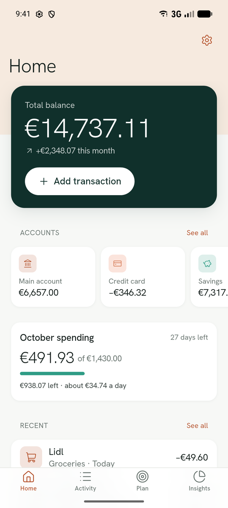
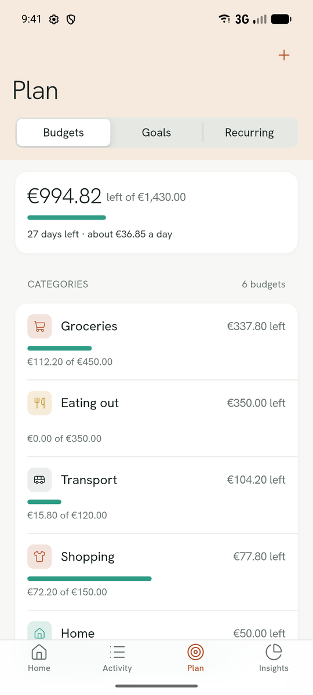
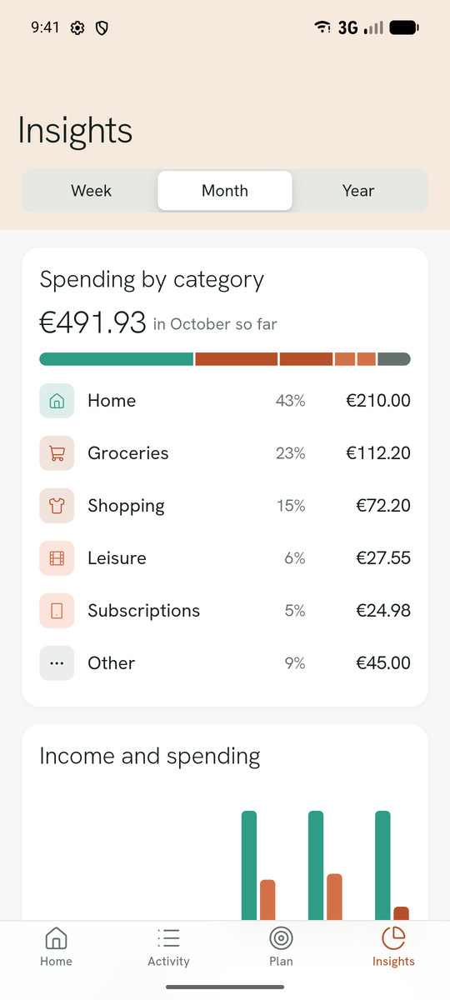
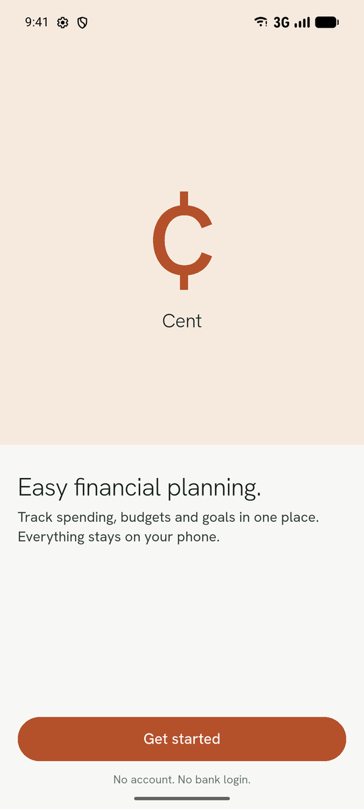
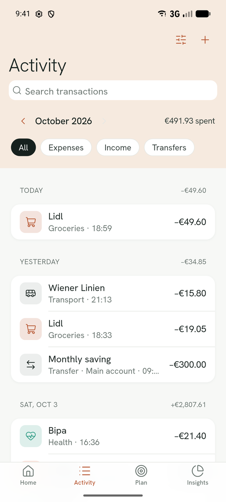
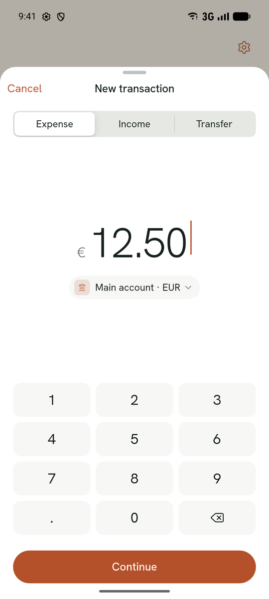
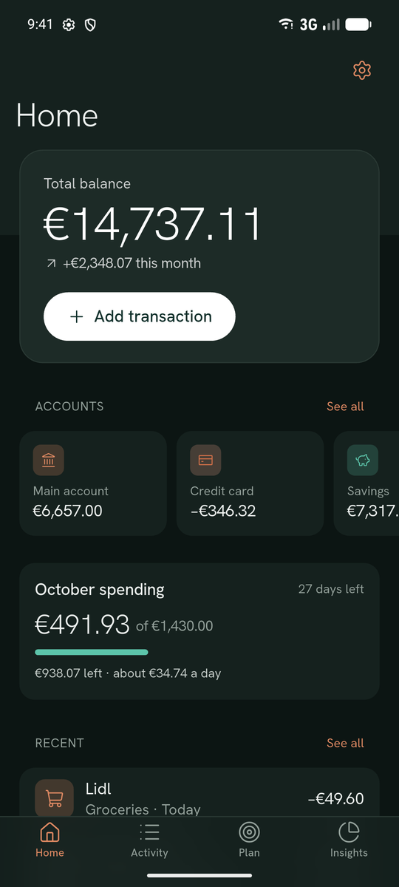
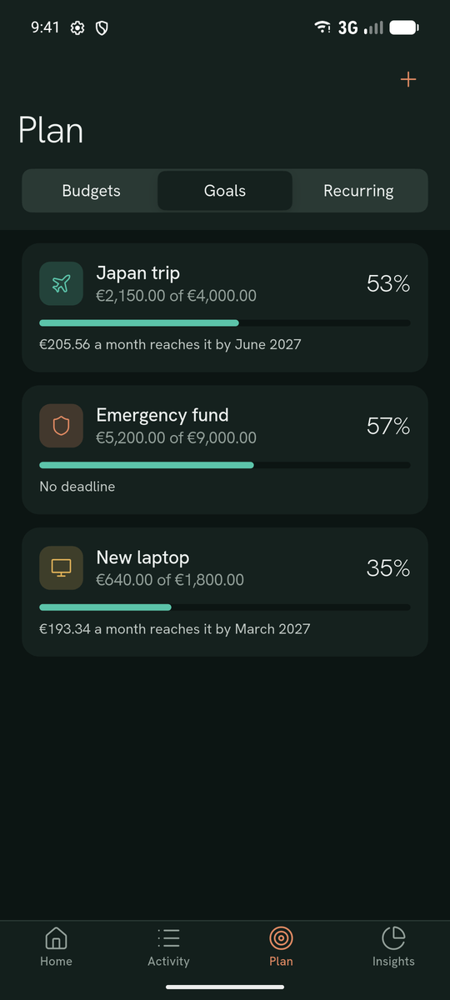
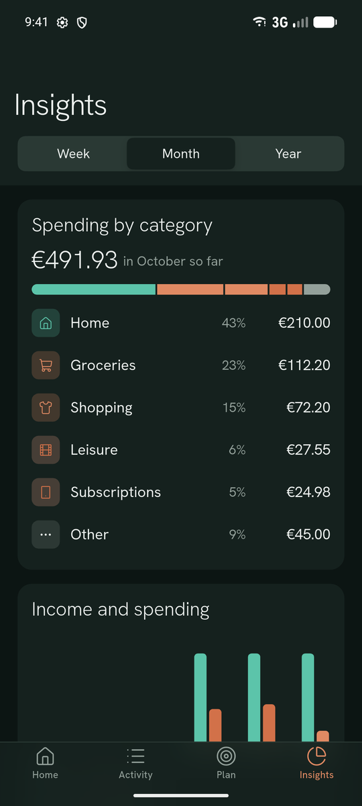

# Cent

A clean personal finance tracker for iOS and Android, built with Flutter.

Log spending in a few taps, keep monthly budgets, save toward goals and see where your money went. Everything stays on your phone: no account, no bank login, no backend.


<p align="center">
  
  &nbsp;
  
  &nbsp;
  
</p>

## Why I built it

Most budgeting apps either want your bank login or make every purchase feel like a warning. Cent goes the other way. It's for people who earn their first real salary and want to see how the month is going in a few seconds, without stress.

I used it to practice building a complete, production-quality mobile app on my own: a design system, local persistence, careful money handling and the details that usually get skipped, like empty and error states, dark mode and backups.

## Features

- **Fast logging**: a custom keypad sheet for expenses, income and transfers, with category, account, date, note and repeat.
- **Accounts**: checking, savings, cash and credit cards, with transfers between them and a balance history chart.
- **Multi-currency**: each account and transaction keeps its own currency. Totals are converted to your base currency using daily ECB rates, which are cached for offline use and can be overridden by hand.
- **Budgets**: monthly limits per category, with a spending pace chart and a daily allowance for the rest of the month.
- **Savings goals**: contributions, progress, and the monthly amount needed to reach a deadline.
- **Recurring payments**: rent, salary and subscriptions are booked automatically when they're due.
- **Insights**: spending by category and income against spending, by week, month or year, with a drill-down per category.
- **Search and filters**: in the full activity history.
- **Privacy**: an optional biometric app lock. The app is blurred in the app switcher.
- **Backups**: export and import a full `.cent` backup through the share sheet, plus CSV export for spreadsheets.
- **Light and dark mode** in an Apple HIG-inspired design that looks the same on iOS and Android.
- **Empty and loading states** that sketch what each screen will hold, plus a retry if something fails to load.
- **Demo data** offered during onboarding, so you can try every screen right away.

## Screenshots

| Onboarding | Activity | New transaction |
| :---: | :---: | :---: |
|  |  |  |

| Home (dark) | Savings goals (dark) | Insights (dark) |
| :---: | :---: | :---: |
|  |  |  |

## Tech stack

| Area | Choice |
| --- | --- |
| UI | Flutter with a custom, iOS-style widget set that looks the same on both platforms |
| State | [Riverpod](https://riverpod.dev) 3 |
| Persistence | [Drift](https://drift.simonbinder.eu) (SQLite) with reactive queries |
| Navigation | [go_router](https://pub.dev/packages/go_router) with a stateful shell for the tab bar |
| Exchange rates | [Frankfurter](https://frankfurter.dev) (ECB data, no API key). This is the only network call |
| Platform | `local_auth`, `share_plus`, `file_picker` |
| Localization | `flutter_localizations` with ARB files, so no hardcoded strings in widgets |

## Architecture

The code is organized by feature, with a thin data layer between the UI and the database.

```
lib/
├── core/        # Design system, money types, database, router, shared widgets
│   ├── database/   # Drift tables and the AppDatabase
│   ├── money/      # Money, Currency, ExchangeRate, formatting
│   ├── theme/      # Colors, typography and spacing tokens
│   └── widgets/    # Cards, sheets, charts, buttons, list parts
├── data/        # Repositories and services (backup, rates, onboarding, demo seeding)
├── features/    # One folder per screen or flow: home, activity, plan, insights, ...
└── l10n/        # ARB strings
```

- **Screens never touch the database directly.** They watch Riverpod providers, which wrap repository streams. Drift pushes changes automatically, so saving a transaction updates Home, Activity, Plan and Insights without any manual refreshes.
- **Pure logic is kept out of widgets.** Insights math, recurrence dates and money conversion are plain Dart functions with their own unit tests.
- **The database is injected through a provider**, so tests swap in an in-memory SQLite instance.

## Engineering details

A few decisions worth pointing out:

- **Money is never a `double`.** Amounts are stored as integers in the currency's minor units (`Money(1250, eur)` is €12.50), and adding two different currencies throws an error.
- **Currency conversion is exact.** Rates are stored as decimal strings and converted with `BigInt` arithmetic, rounding half away from zero, so there is no floating-point drift in totals.
- **Recurring dates don't drift.** A payment on the 31st falls on Feb 28 (or 29) and goes back to the 31st the month after, instead of moving to the 28th for good.
- **Restoring a backup is all or nothing.** The file is validated before anything is touched, then the restore runs in a single transaction, so a broken file can't leave the database half-written.
- **Rates only refresh when they're stale.** ECB publishes once per working day, so Cent refreshes at most every 12 hours and falls back to cached rates if the request fails.
- **Demo data is deterministic.** The seeder uses a fixed random seed, so screenshots and tests are reproducible.
- **Strict static analysis**: `strict-casts`, `strict-inference` and `strict-raw-types` are enabled, along with a stricter lint set.

## Getting started

Requirements: Flutter 3.47 or newer (Dart 3.13), and Xcode or Android Studio for a simulator or device.

```sh
git clone https://github.com/initcommit43/Cent.git
cd Cent
flutter pub get
dart run build_runner build   # generates the Drift code, which isn't committed
flutter run
```

On first launch, choose **Explore with demo data** to fill the app with three months of example activity. You can clear it later in Settings.

## Testing

```sh
flutter test
flutter analyze
```

The tests cover money arithmetic and currency conversion, recurrence rules, insights calculations, the repositories against an in-memory database, backup round-trips, the exchange rate service with a mocked HTTP client, the loading and error states, and the onboarding flow.

## Credits

- [Hanken Grotesk](https://fonts.google.com/specimen/Hanken+Grotesk) by Alfredo Marco Pradil, under the SIL Open Font License
- [Lucide](https://lucide.dev) icons
- Exchange rates from [Frankfurter](https://frankfurter.dev), based on European Central Bank reference rates
